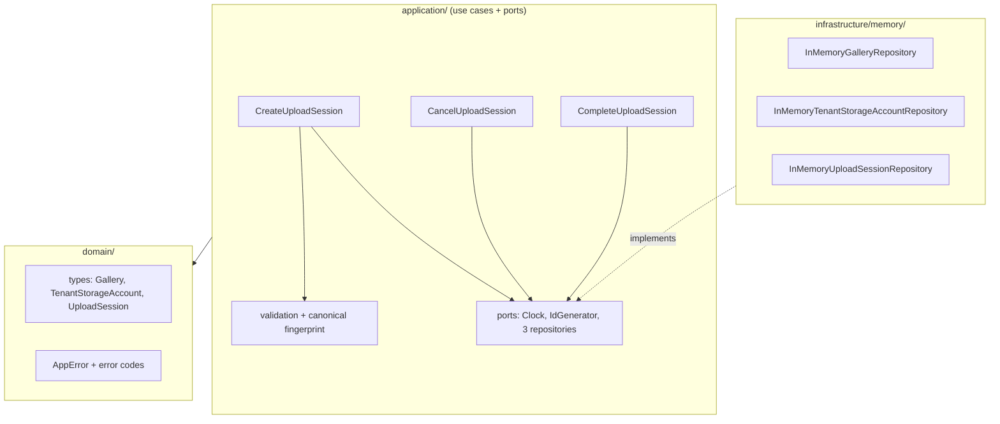

<div align="center">

# PixSync Upload Session Core

**Multi-tenant upload session management with atomic quota reservations, tenant-scoped idempotency, and exactly-once completion semantics.**

A production-grade TypeScript domain core for a direct-to-object-storage (Backblaze B2) photo upload flow.

[](https://github.com/y9090oussefwork/pixsync-upload-session-core/actions/workflows/ci.yml)
[](LICENSE)
[](tsconfig.json)
[](package.json)
[](#testing)

</div>

---

## بالعربية

**نواة إدارة جلسات الرفع متعددة المستأجرين (Multi-Tenants) لمشروع PixSync** — مكتبة TypeScript خلفية (ليست واجهة HTTP ولا تتصل بـ B2 فعليًا) تنفّذ ثلاث حالات استخدام: إنشاء جلسة رفع، إلغاء جلسة، وإكمال جلسة، مع ضمانات صارمة:

- **حصة تخزين ذرّية (Atomic Quota):** العملية `reserve / commit / release` تُنفَّذ كخطوة فحص-وتحديث واحدة لا يمكن أن يتسلل بينها طلبان متزامنان، فالقاعدة `used + reserved ≤ limit` لا تُنتهك أبدًا. عند سباق طلبين (80MB + 80MB) على حصة 100MB ينجح واحد فقط حتميًا.
- **Idempotency على مستوى كل مستأجر:** تكرار نفس الطلب بنفس المفتاح يعيد نفس الجلسة الأصلية دون حجز مزدوج، وتغيير الحمولة مع نفس المفتاح يرفض بـ `IDEMPOTENCY_CONFLICT`.
- **ذرية الفشل:** إذا نجح حجز الحصة ثم فشلت عملية الحفظ، يُحرَّر الحجز تلقائيًا ولا تتسرب أي بايت.
- **أمان تعدد المستأجرين:** الاستعلام عن معرض يعود لمالك آخر يعيد نفس خطأ "غير موجود" تمامًا — لا تسريب لوجود الموارد من عدمه.
- **مفاتيح تخزين يولّدها الخادم:** اسم الملف الخام لا يصل أبدًا إلى مفتاح الكائن، مع رفض أسماء الملفات غير الآمنة (path traversal، فواصل مسارات، محارف تحكم).

> **ملاحظة حول "بيانات الدخول الافتراضية":** هذا المشروع مكتبة خلفية وليس تطبيقًا بواجهة، لذا لا يوجد تسجيل دخول أو كلمات مرور. المكافئ هنا هو **بيانات البذرة الافتراضية** في العرض التوضيحي (`npm run demo`): المستأجر `t-1`، المزوّد `p-1`، المعرض `g-1`، وحصة 100MB — كلها موثّقة أدناه.

---

## Why this project

Most upload flows get quota accounting wrong in exactly three ways: read-compare-write races that double-spend storage, idempotency keys that collide across tenants, and reservations leaked when persistence fails after the quota check. This core eliminates all three with a small, dependency-free, fully tested domain layer whose repository ports map one-to-one onto PostgreSQL primitives.

## Features

- **3 use cases**: `createUploadSession`, `cancelUploadSession`, `completeUploadSession`
- **Atomic quota primitives** (`reserveBytes` / `commitBytes` / `releaseBytes`) — check-and-set inside the repository, never in the service
- **Tenant-scoped idempotency** with canonical SHA-256 payload fingerprints (property- and order-independent)
- **Exactly-once state transitions** via compare-and-set status changes — quota release/commit can never double-fire
- **Failure atomicity**: persistence errors after reservation are compensated automatically
- **No N+1**: sessions persist as whole aggregates; repository call counters are asserted in tests
- **Security-first validation**: extension whitelist, size bounds, sha256 format, unsafe filename rejection, server-generated object keys, no existence leaks across tenants
- **Deterministic tests**: injected `Clock` and `IdGenerator` — zero sleeps, zero randomness
- **57 tests** covering concurrency races, idempotency replays, quota invariants, and batch efficiency

## Quick start

```bash
# 1. Install (Node.js >= 20)
git clone https://github.com/y9090oussefwork/pixsync-upload-session-core.git
cd pixsync-upload-session-core
npm install

# 2. Run the end-to-end demo (builds, then walks through every guarantee)
npm run demo

# 3. Verify the quality gates
npm run typecheck   # tsc --noEmit, strict mode
npm test            # vitest run — 57 tests
```

### Default demo data

The core has no login or credentials (it is a library). The demo seeds this environment:

| Seed | Value | Meaning |
|---|---|---|
| `tenantId` | `t-1` | Demo tenant |
| `providerId` | `p-1` | Demo storage provider |
| `galleryId` | `g-1` | ACTIVE gallery owned by `t-1`/`p-1` |
| `limitBytes` | `100 MB` | Tenant storage quota |

### Demo output

```text
=== 1. Create an upload session (20 MB reserved, expires in 15 min) ===
session demo-1 status=PENDING
  f-1 -> tenants/t-1/galleries/g-1/demo-2.jpg
  f-2 -> tenants/t-1/galleries/g-1/demo-3.png
tenant t-1: used=0.0MB reserved=20.0MB limit=100.0MB

=== 2. Idempotent replay returns the SAME session (no double reservation) ===
same id? true

=== 3. Reusing the key with a different payload -> IDEMPOTENCY_CONFLICT ===
rejected with code=IDEMPOTENCY_CONFLICT

=== 4. Complete the session -> reserved bytes move to used bytes ===
status=COMPLETED
tenant t-1: used=20.0MB reserved=0.0MB limit=100.0MB

=== 5. A second 95 MB request now exceeds the remaining quota ===
rejected with code=QUOTA_EXCEEDED
```

## Usage

```ts
import {
  createUploadSessionCore,
  InMemoryGalleryRepository,
  InMemoryTenantStorageAccountRepository,
  InMemoryUploadSessionRepository,
  SequenceIdGenerator,
  FixedClock,
} from "pixsync-upload-session-core";

const core = createUploadSessionCore({
  galleries: new InMemoryGalleryRepository([
    { id: "g-1", tenantId: "t-1", providerId: "p-1", status: "ACTIVE" },
  ]),
  accounts: new InMemoryTenantStorageAccountRepository([
    { tenantId: "t-1", limitBytes: 100 * 1024 * 1024, usedBytes: 0, reservedBytes: 0 },
  ]),
  sessions: new InMemoryUploadSessionRepository(),
  ids: new SequenceIdGenerator("id"), // or a UUID generator in production
  clock: new FixedClock(Date.now()),  // or { now: () => Date.now() }
});

const session = await core.createUploadSession({
  tenantId: "t-1",
  providerId: "p-1",
  galleryId: "g-1",
  idempotencyKey: "req-001",
  files: [
    { clientFileId: "f-1", fileName: "sunset.JPG", sizeBytes: 12_000_000, sha256: "a".repeat(64) },
  ],
});
// -> session.files[0].objectKey === "tenants/t-1/galleries/g-1/id-2.jpg"

await core.completeUploadSession("t-1", session.id, ["f-1"]); // reserved -> used
// or: await core.cancelUploadSession("t-1", session.id);     // reserved released
```

Errors are thrown as `AppError` with a machine-readable `code` (see [docs/api.md](docs/api.md)).

## Architecture



- **`domain/`** — entities and explicit error codes. Zero dependencies.
- **`application/`** — use cases depend only on ports; the business layer never imports the in-memory infrastructure.
- **`infrastructure/memory/`** — repository adapters. Each operation crosses an async I/O boundary (`setImmediate`) and then performs a **synchronous check-and-set critical section** — the same guarantee a single conditional PostgreSQL `UPDATE` provides.

Full details: [docs/architecture.md](docs/architecture.md) · API reference: [docs/api.md](docs/api.md)

### The concurrency model in one picture

```text
request A (80 MB) ──┐
                    ├──► reserveBytes: IF used+reserved+80MB <= 100MB THEN reserved+=80MB
request B (80 MB) ──┘        (one atomic check-and-set — exactly one can pass)
```

`usedBytes + reservedBytes <= limitBytes` is enforced **inside** the repository primitive, so no interleaving of concurrent callers can break it. Status changes (`PENDING → COMPLETED/CANCELLED`) are compare-and-set, making quota commit/release exactly-once even under concurrent duplicate requests.

## Validation rules

| Rule | Limit |
|---|---|
| Files per session | 1 – 50 |
| File size | > 0 and ≤ 2 GiB |
| `clientFileId` | unique within request |
| `sha256` | exactly 64 lowercase hex chars |
| Extensions | `.jpg .jpeg .png .webp .heic` (case-insensitive) |
| File names | no path traversal, no directory separators, no control characters |
| Object keys | `tenants/{tenantId}/galleries/{galleryId}/{serverId}.{ext}` — raw filename never used |
| Session expiry | creation + 15 minutes (injected `Clock`) |

## Error codes

| Code | Meaning |
|---|---|
| `GALLERY_NOT_FOUND` | missing, cross-tenant, or cross-provider gallery (indistinguishable) |
| `GALLERY_LOCKED` | gallery exists but is LOCKED |
| `INVALID_UPLOAD` | request/file/confirmation validation failure |
| `QUOTA_EXCEEDED` | atomic reservation rejected |
| `IDEMPOTENCY_CONFLICT` | same key, different logical payload |
| `UPLOAD_SESSION_NOT_FOUND` | missing or cross-tenant session (indistinguishable) |
| `INVALID_SESSION_STATE` | transition not allowed (e.g. cancel a COMPLETED session) |
| `PERSISTENCE_FAILURE` | storage failed; reservation was compensated |
| `TENANT_NOT_FOUND` | tenant has no storage account |

## Project structure

```text
src/
  domain/            types.ts, errors.ts
  application/       ports.ts, validation.ts, core.ts,
                     create-upload-session.ts, cancel-upload-session.ts,
                     complete-upload-session.ts
  infrastructure/
    memory/          in-memory repositories, FixedClock, SequenceIdGenerator
tests/               6 suites, 57 tests (helpers instrument every repository call)
examples/demo.mjs    runnable end-to-end walkthrough
docs/                architecture.md, api.md
.github/             CI workflow, issue & PR templates
```

## Testing

```bash
npm test          # single run
npm run test:watch
```

The suite proves the hard properties, not just the happy paths:

- concurrent 80 MB vs 80 MB on 100 MB quota → **exactly one** succeeds
- 12-way concurrent burst → invariant `used + reserved <= limit` holds
- persistence failure after reservation → **zero** leaked bytes
- idempotent replay → same session, same object keys, **one** reservation
- concurrent cancel/complete → quota released/committed **exactly once** (counted)
- 50-file session → **2** session-repository calls total (no per-file N+1)

Repository call counters are injected via a Proxy instrumentation layer in [tests/helpers.ts](tests/helpers.ts), so batch behavior is asserted, not assumed.

## Swapping in PostgreSQL

The ports are designed to translate directly:

| Port method | PostgreSQL equivalent |
|---|---|
| `reserveBytes` | `UPDATE tenant_storage_accounts SET reserved_bytes = reserved_bytes + $amt WHERE tenant_id = $t AND used_bytes + reserved_bytes + $amt <= limit_bytes` (0 rows → QUOTA_EXCEEDED) |
| `commitBytes` | same statement moving bytes `reserved → used` with `reserved_bytes >= $amt` guard |
| `saveIfAbsent` | `INSERT ... ON CONFLICT (tenant_id, idempotency_key) DO NOTHING RETURNING *` |
| `compareAndSetStatus` | `UPDATE upload_sessions SET status = $next WHERE id = $id AND tenant_id = $t AND status = $expected` |

No use-case code changes are required. See [docs/architecture.md](docs/architecture.md) for the full guide.

## Roadmap

- [ ] Expiry enforcement (sweep expired PENDING sessions and release reservations)
- [ ] PostgreSQL repository reference implementation
- [ ] HTTP transport package (thin layer over this core)
- [ ] Presigned-upload confirmation integration with B2

Contributions welcome — see [CONTRIBUTING.md](CONTRIBUTING.md).

## License

[MIT](LICENSE) © 2026 y9090oussefwork
